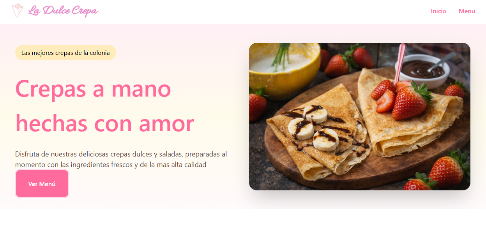
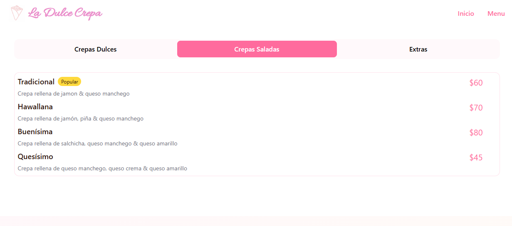
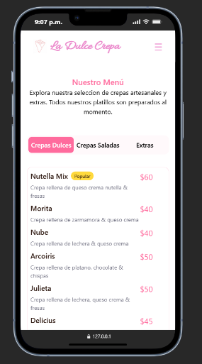

# 🥞 La Dulce Crepa

Sitio web para un negocio de crepas, diseñado para mostrar un menú atractivo, moderno y visualmente apetitoso, enfocado en mejorar la experiencia del cliente y aumentar el interés por los productos.

## 📸 Preview

<p align="center">
  
  
  
</p>

---

## ✨ Características

* 🍓 Menú visual de crepas dulces y saladas
* 🎨 Diseño moderno y atractivo orientado a clientes
* 📱 Estructura adaptable para dispositivos móviles (responsive)
* 🖼️ Imágenes optimizadas para una mejor experiencia visual
* ⚡ Carga rápida y navegación sencilla

---

## 🛠️ Tecnologías utilizadas

* HTML5
* CSS3 (Flexbox, diseño responsivo)
* JavaScript (interactividad básica)

---

## 🎯 Objetivo del proyecto

Este proyecto fue desarrollado con el objetivo de:

* Crear una interfaz atractiva para un negocio real
* Practicar diseño UI enfocado en alimentos
* Mejorar habilidades en maquetación web
* Aplicar buenas prácticas de diseño visual

---

## 📂 Estructura del proyecto

```text
📁 La-Dulce-Crepa
 ┣ 📁 css
 ┣ 📁 img
 ┣ 📁 js
 ┣ 📄 index.html
 ┣ 📄 README.md
```

---

## ⚙️ Instalación

1. Clona el repositorio:

```bash
git clone https://github.com/Elliot1990/La-Dulce-Crepa.git
```

2. Abre el archivo `index.html` en tu navegador

---

## 🌐 Deploy

Puedes ver el proyecto en línea en:

👉 https://elliot1990.github.io/La-Dulce-Crepa/

---

## 📌 Mejoras futuras

* 🛒 Sistema de pedidos online
* 📍 Integración con Google Maps
* 💳 Métodos de pago
* 📞 Formulario de contacto
* ⭐ Reseñas de clientes

---

## 👨‍💻 Autor

Desarrollado por **Elliot**

---

## ⭐ Si te gustó

Dale una estrella ⭐ al repositorio
